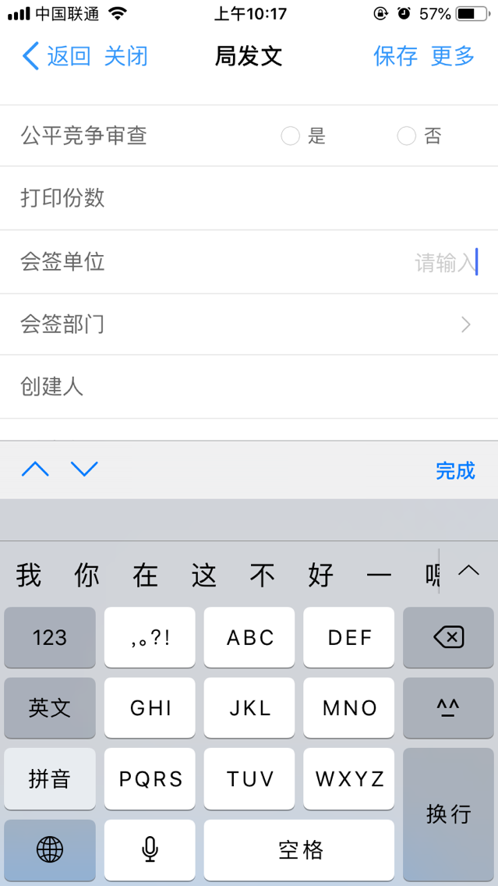
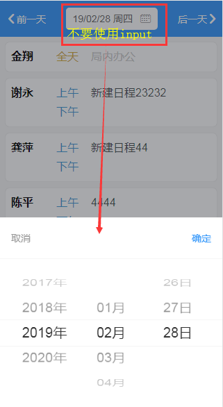

# 移动端
[toc]
## css高级运用
#### 去掉最后一个元素的边框
```css
.list .item:not(:last-child) {
  border-right: 1px solid #666;
}
// ps: 开动小脑筋，可灵活运用哦！
```


#### 选择前几个元素
```css
// 只显示前3个元素
li{
  display: none;
}
li:nth-child(-n+3) {
  display: block;
}
// ps: 开动小脑筋，可灵活运用哦！
```

#### 利用选择器来给元素添加默认值
```css
div[contenteditable]:empty:not(:focus):before {
  content: attr(placeholder);
  color: #ccc ;
  font-size: 16px;
}

a[href^="http"]:empty::before {
  content: attr(href);
}

// 开动小脑筋，还可以扩展哦！
```


#### 隐藏没有静音、自动播放的影片
```css
video[autoplay]:not([muted]) {
  display: none;
}

// 非全屏播放
<video src="test.mp4" webkit-playsinline="true"></video>
```

## 补充
使用CSS transforms 或者 animations时可能会有页面闪烁的bug
-webkit-backface-visibility: hidden;

禁止长按链接与图片弹出菜单
-webkit-touch-callout: none;

[touch-action](https://developer.mozilla.org/zh-CN/docs/Web/CSS/touch-action)
touch-action: 用于指定某个给定的区域是否允许用户操作，以及如何响应用户操作（比如浏览器自带的划动、缩放等）

---------

## 移动端场景及解决方案
### 1.怎样解决点击输入避免键盘弹起
#### 输入键盘弹起效果图


#### 页面需求效果图


> 点击选择日历，如果使用`input`标签就会默认弹起键盘，就算点击时隐藏键盘页面也会有闪烁效果

#### 解决方案
> 使用 `div`,`button`添加`contenteditable="true"`属性代替`input`

### 2.IOS中`contenteditable=true`无法输入

#### 解决方案添加css样式
```css
div{  
  -webkit-user-select:text;
}
```

### 3.滚动条滑动内容不顺畅

```css
div{  
  height: 300px;
  overflow-y: auto;  //在此区域滚动
  -webkit-overflow-scrolling: touch;  // 添加此属性解决滑动内容不顺畅
}
```

### 4.`fixed`固定元素在顶部或底部
```html
  <div class="wrap">
    <div class="header">
    
    </div>
    <div class="content">
    
    </div>
    <div class="footer">
    
    </div>
  </div>
```
#### 方案一
```css
.header{  
  height: 50px;
  position: fixed;  //固定元素，滚动内容元素时会漂浮在上面
  top: 0;
  left: 0;
  right: 0;
}
.content{  
  height: calc(100vh - 50px);  // 内容区域高度=视口高度-头部高度
  -webkit-overflow-scrolling: touch;
}
```

#### 方案二
```css
.header{  
  height: 50px;
  position: fixed;  //固定元素，滚动内容元素时会漂浮在上面
  top: 0;
  left: 0;
  right: 0;
}
.content{  
  margin-top: 50px;   // header高度
  -webkit-overflow-scrolling: touch;
}
```

### 5.页面跳转后返回页面页面会刷新
> 场景：输入表单内容后，切换页面选择内容，返回后表单数据丢失

#### 解决方案
> vue缓存路由


### 问题记录：
#### 1.表单中使用`fixed`固定按钮在底部时，`input`弹起输入框按钮会在键盘上面

[toc]