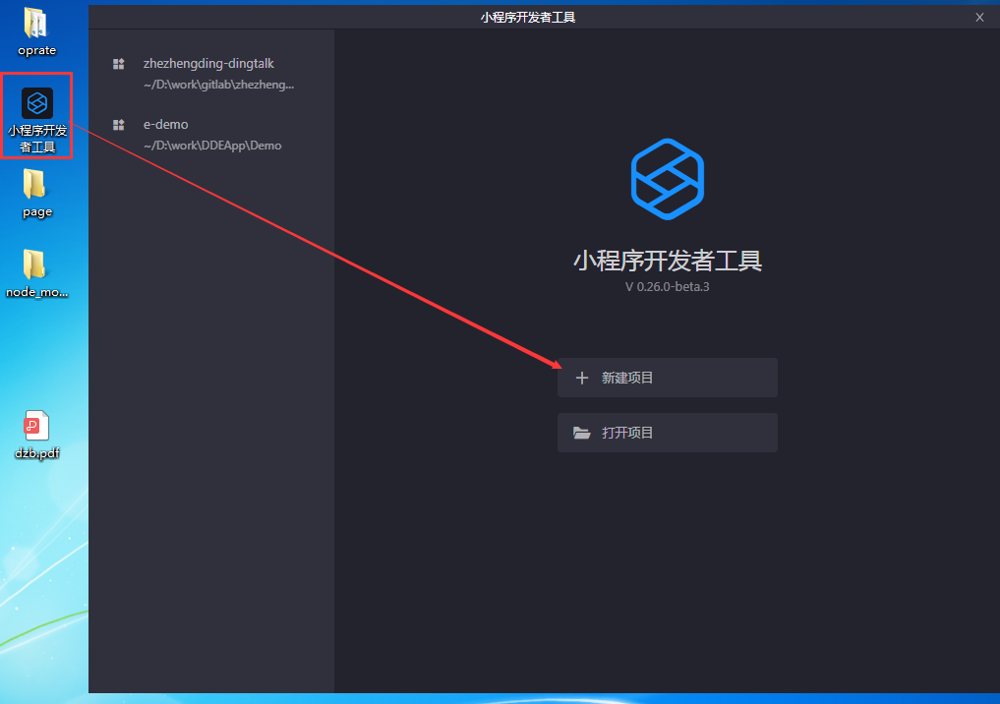
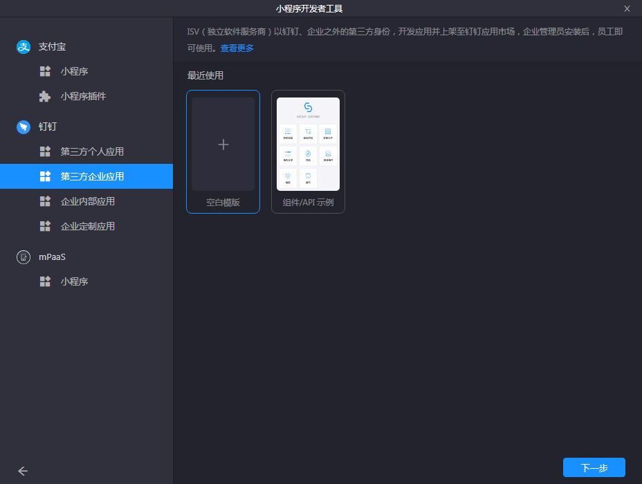
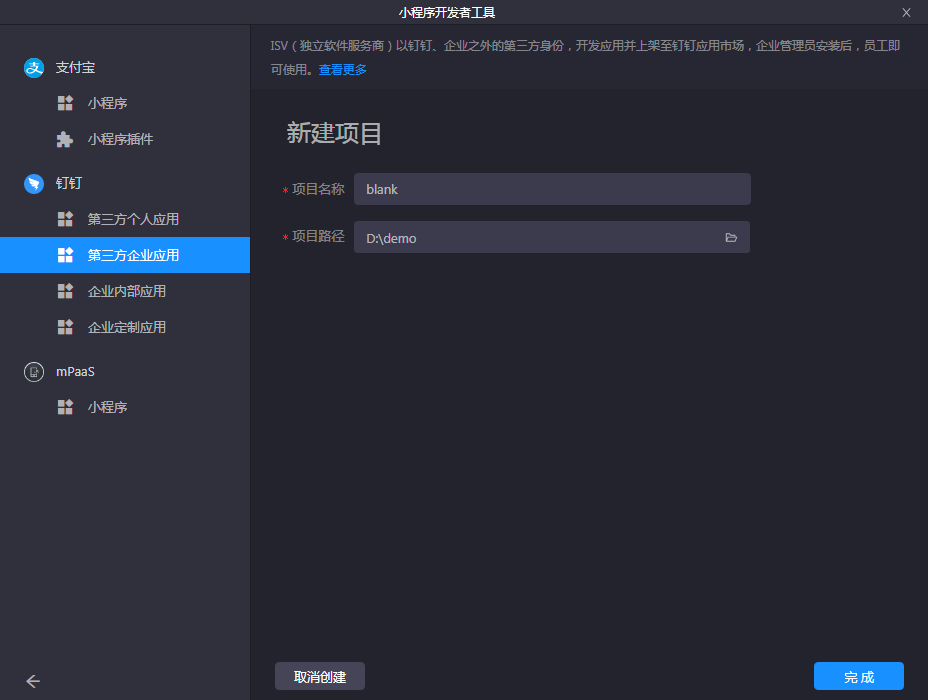
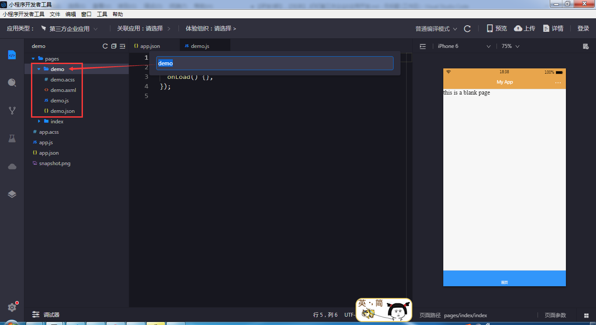
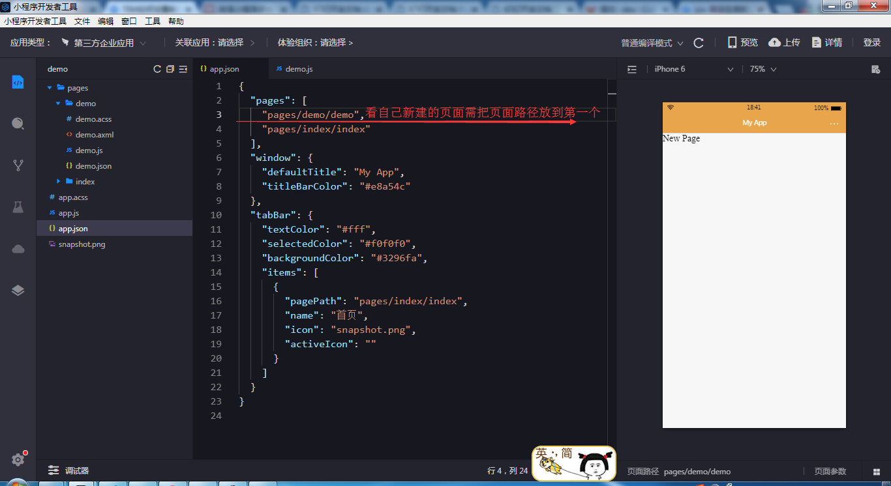

# 钉钉E应用

[应用管理登录](https://oa.dingtalk.com/?redirect=http%3A%2F%2Foa.dingtalk.com%2Fomp%2Fapi%2Fmicro_app%2Fadmin%2Flanding%3Fcorpid%3Dopen-dev.dingtalk.com%26redirect_url%3Dhttp%3A%2F%2Fopen-dev.dingtalk.com%2F#/login) 

[创建应用步骤](https://open-doc.dingtalk.com/microapp/isv/yeun2g#a-nameuewihba%E5%88%9B%E5%BB%BA%E5%BA%94%E7%94%A8)

[后台管理登录](https://oa.dingtalk.com/#/login) 
 


1.[下载前端发开工具](https://open-doc.dingtalk.com/microapp/debug/ide#a-name0pg5plabeta-%E7%89%88-v0250-beta-%EF%BC%9A)

2.[创建项目](https://open-doc.dingtalk.com/microapp/isv/oq1uge#a-namer28hkwa%E9%A1%B9%E7%9B%AE%E5%88%9B%E5%BB%BA)
> 打开开发者工具


> 选择应用新建空白项目


> 选择项目路径


> 目录结构文件说明


> 选中想在的目录右键=>新建小程序页面=>输入文件名


> 生成目录结构=>可查看app.json文件，页面路径已生成


> 查看新页面


3.[组件API](https://open-doc.dingtalk.com/microapp/dev/framework-overview)

4.[页面全局配置](https://open-doc.dingtalk.com/microapp/dev/framework-app#appjson)
```js
// app.js
App({
  onLaunch(options) {
    // 第一次打开
    // options.query == {number:1}
    console.info('App onLaunch');
  },
  onShow(options) {
    // 从后台被 scheme 重新打开
    // options.query == {number:1}
  },
  globalData: {     // 全局变量
    baseUrl: 'http://47.97.63.60:9082',
  },
});

// 其他页面获取全局变量
let app = getApp()
console.log(app.globalData)

// app.json
{
  "pages": [    // 设置页面路径,所有页面路径均需写在这里
    "pages/index/index",
    "pages/logs/index",
    ...
  ],
  "window": {   // 设置默认页面的窗口表现
    "defaultTitle": "Demo"    // 页面默认标题
    "titleBarColor": "#eee"   // 导航栏背景色
    "pullRefresh": false  // 是否允许下拉刷新。默认 false
    "allowsBounceVertical": "YES"     // 页面是否支持纵向拽拉超出实际内容。默认 YES
  },
  "tabBar": {     // 设置底部 tab 的表现
    "textColor": "#dddddd",     // 默认文字颜色
    "selectedColor": "#49a9ee",   // 高亮文字颜色
    "backgroundColor": "#fff",   // 背景色
    "items": [    // tab配置项
      {
        "pagePath": "pages/index/index",    // 必填 设置页面路径 ：第一个必须与首页pages中第一个路径一致，否则不出来
        "name": "首页",       // 必填 名称
        "icon": "",         // 默认图标
        "activeIcon": ""    // 高亮图标
      },
      ...
    ]
  }
}
```

5.[单页面配置](https://open-doc.dingtalk.com/microapp/dev/framework-page)
```js
// page.json
{   // 覆盖app.json中window配置
  "defaultTitle": "Demo"    // 页面默认标题
  "titleBarColor": "#eee"   // 导航栏背景色
  "pullRefresh": false  // 是否允许下拉刷新。默认 false
  "allowsBounceVertical": true     // 页面是否支持纵向拽拉超出实际内容
}
```

6.[页面跳转传参](https://open-doc.dingtalk.com/microapp/dev/ui-navigate)
> dd.navigateTo 和 dd.redirectTo 不允许跳转到 tabbar 页面；如果需要跳转到 tabbar 页面，请使用 dd.switchTab。

```js
// 保留当前页面，跳转到应用内的某个指定页面
dd.navigateTo({
  url: 'new_page?count=100',   //a页面跳转到b页面传递参数
  success: (res) => {},
  fail: (err) => {},
  complete: () => {}
})

// 设置导航栏文字及样式  注：写在navigateTo后面
dd.setNavigationBar({
  title: '你好',
  backgroundColor: '#108ee9',
  reset: false,     // 是否重置导航栏为钉钉默认配色，默认 false
  success: (res) => {},
  fail: (err) => {},
  complete: () => {}
})

// b页面js
page({
  onLoad(e){
    // console.log(e.count)     // e 可获得a页面传递的参数
  }
})

// 关闭当前页面，返回上一级或多级页面 
// console.log(getCurrentPages())   // 获取当前页面栈的实例
dd.navigateBack({
  delta: 2    // 返回的页面数，如果 delta 大于现有打开的页面数，则返回到首页
})

// 关闭当前页面，跳转到应用内的某个指定页面
dd.redirectTo({
  url: 'new_page?count=100',
  success: (res) => {},
  fail: (err) => {},
  complete: () => {}
})


// 跳转到指定 tabBar 页面，并关闭其他所有非 tabBar 页面
dd.switchTab({
  url: '/home',
  success: (res) => {},
  fail: (err) => {},
  complete: () => {}
})


//关闭当前所有页面，跳转到应用内的某个指定页面
dd.reLaunch({
  url: 'new_page?count=100',
  success: (res) => {},
  fail: (err) => {},
  complete: () => {}
})
```

### 组件调用

```js
// 时间控件
dd.datePicker({
  currentDate: '2019-01-01',
  startDate: '2019-01-01',
  endDate: '2019-12-31',
  success: (res) => {
    this.setData({
      endDate: res.date
    })
  },
});


// 隐藏键盘
dd.hideKeyboard()

// 选部门
dd.chooseDepartments()

// 设置导航栏
dd.setNavigationBar({
  title: '设置页面导航栏',
  backgroundColor: '#ffffff',
  borderBottomColor: '#ffffff'
})


dd.httpRequest({
  url: '',
  headers: {
    'Content-Type': 'application/json;charset=UTF-8'
  },
  data: '',
  dataType: 'text',
  success: (res) => {
    let data = JSON.parse(res.data)
  },

});

// 视频组件
<video
    src=""  // 视频路径
    autoplay="{{false}}"  // 自动播放
    onPlay="playing"  // 开始播放
    onPause="stopPlay" // 暂停
    onEnded="endPlay" 
    onError="playError" 
    onTimeUpdate="onTimeUpdate" 
    objectFit="contain" 
> 
```

[钉钉 JSAPI](https://open-doc.dingtalk.com/docs/doc.htm?spm=a219a.7629140.0.0.29d54a972dCX1z&treeId=171&articleId=106834&docType=1)
- [使用npm安装](https://www.npmjs.com/package/dingtalk-jsapi#%E5%AE%89%E8%A3%85)
```shell
  npm install dingtalk-jsapi --save
```

- [使用](https://www.npmjs.com/package/dingtalk-jsapi#%E4%BD%BF%E7%94%A8%E4%BB%8B%E7%BB%8D)


### 错误信息
#### 上传图片 无权跨域调用
> 在应用中【设置安全域名】


存在问题 https://blog.csdn.net/dkr380205984/article/details/83583996#commentBox


### 补充说明
[CorpId](https://open-dev.dingtalk.com/#/corpAuthInfo)

[套件开发](https://open-doc.dingtalk.com/docs/doc.htm?spm=a219a.7629140.0.0.45374a97semUSa&treeId=175&articleId=104943&docType=1)


[微应用开发Api](https://g.alicdn.com/dingding/opendoc/docs/_pc/tab1.html?t=1467363847836)

[SaltUI](https://g.alicdn.com/dingding/opendoc/docs/_saltui/tab1.html?t=1467363848198)


https://g.alicdn.com/dingding/opendoc/docs/_client/tab3.html?t=1467363847744

https://open-doc.dingtalk.com/docs/doc.htm?spm=a219a.7629140.0.0.21274a97vsiCbb&treeId=171&articleId=104910&docType=1


https://github.com/open-dingtalk/which-language-demo/tree/master/vue-fed-oapage